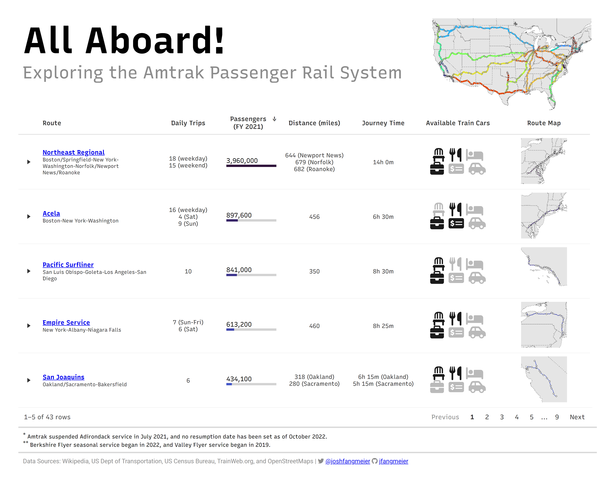

<!-- README.md is generated from README.Rmd. Please edit that file -->

```{r, include = FALSE}
knitr::opts_chunk$set(
  collapse = TRUE,
  comment = "#>"
)
```

# Posit Table Contest Submission 2022

### The Table



### Tutorial/Walkthrough

Posted on [**Quarto Pub**](https://joshfangmeier.quarto.pub/table-contest-2022/){target="'_blank'"}, including step-by-step guide of generating graphics and nested table using `reactable`, `reactablefmtr`, and other packages/functions.

### Repository Overview

This repo is basic and includes the following files or interest:

-   R/amtrak-table.qmd: quarto file including all the code to generate the table

-   R/data-prep.qmd: quarto file for reading, cleaning, and preparing the station, routes, and ridership data

-   data/\*.rds: prepped files used to create the table
